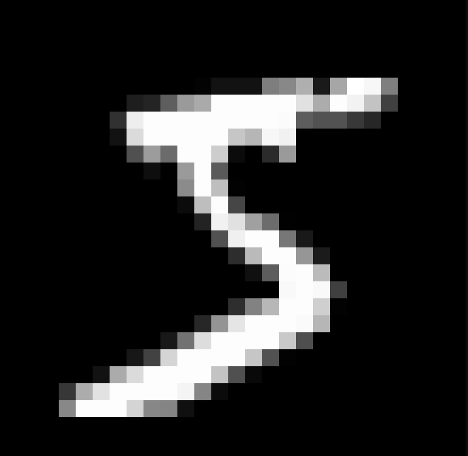
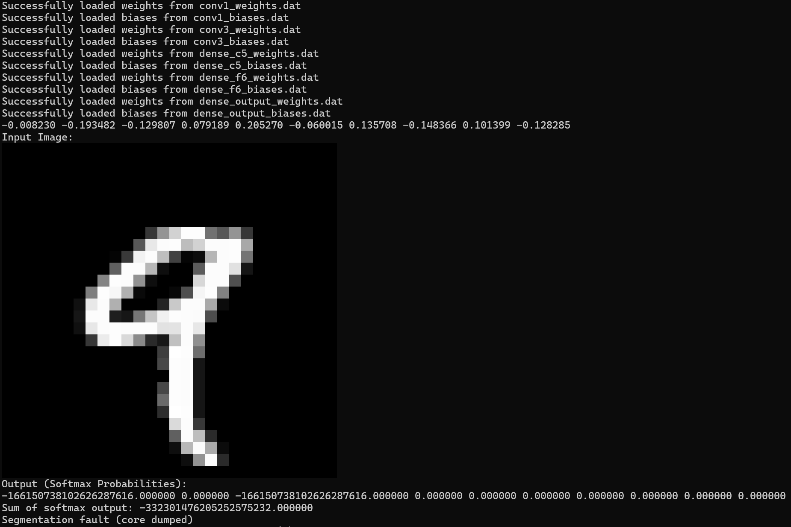

# LeNet-5 model

*Last update: 2025.01.03*

*Contributors:* **DU Jack, LAROYE Ambroise**
## Get started

### Install prerequesities

```
python3 -m venv .venv

# Activate the environment
# Linux/MacOs
source .venv/bin/activate

# Windows
.\.venv\Scripts\activate

# Install the dependencies
pip install -r requirements.txt
```

### Leave the environment after usage
```
deactivate
```

## **TP : Implémentation d'un CNN - LeNet-5 sur GPU**

### **Objectifs & Méthodes de travail:**

Les objectif de ces 4 séances de TP de HSP sont :
- Apprendre à utiliser CUDA,
- Etudier la complexité de vos algorithmes et l'accélération obtenue sur GPU par rapport à une éxécution sur CPU,
- Observer les limites de l'utilisation d'un GPU,
- Implémenter "from scratch" un CNN : juste la partie inférence et non l'entrainement,
- Exporter des données depuis un notebook python et les réimporter dans un projet cuda,
- Faire un suivi de votre projet et du versionning à l'outil git

### **Implémentation d'un CNN** 
L'objectif à terme de ces 4 séances est d'implémenter l'inférence dun CNN très claissque : LeNet-5 proposé par Yann LeCun et al. en 1998 pour la reconnaissance de chiffres manuscrits.

La lecture de cet article vous apportera les informations nécessaires pour comprendre ce réseau de neurone.


**Layer 3 Attention**: Contraitement à ce qui est décrit dans l'article, la 3eme couche du CNN prendra en compte tous les features pour chaque sortie.

## **Partie 1 : Prise en main de CUDA: Multiplication de matrices**

**Multiplication de matrices**

**Paramètres:**
- n : nombre de lignes de la matrice,
- p : nombre de colonnes de la matrice si n différent de p,
- M : pointeur de la matrice

**Allocation de mémoire** <br>
L'allocation de la mémoire (malloc) se fera dans votre fonction principale main.

***

### **1.1 Création d'une matrice sur CPU** <br>
Cette fonction initialise une matrice de taille n x p Initialisez les valeurs de la matrice de façon aléatoire entre -1 et 1.

```
void MatrixInit(float *M, int n, int p)
```

**Résultat:**<br>
Execute 
`./matrix`
```
-0.46 -0.61 0.67 
-0.17 -0.96 -0.69 
0.38 0.61 -0.35
```

***

### **1.2 Affichage d'une matrice sur CPU**<br>
Cette fonction affiche une matrice de taille n x p.

```
void MatrixPrint(float *M, int n, int p)
```

**Résultat:**: 
Execute 
`./matrix-print`
```
-0.20 0.83 0.16 0.98 -0.02 
0.68 -0.20 0.45 0.77 -0.09 
0.75 -0.13 0.37 0.22 -0.24
```

***
### **1.3 Addition de deux matrices sur CPU** <br>
Cette fonction additionne deux matrices M1 et M2 de même taille n x p.
```
void MatrixAdd(float *M1, float *M2, float *Mout, int n, int p)
```

**Résultat:**<br>
Execute 
`./matrix-add`
```
Matrice M1 :
-0.54 0.39 -0.73 -0.78 
-0.09 -0.42 -0.84 0.70 
0.70 -0.04 -0.18 -0.80 

Matrice M2 :
-0.54 0.39 -0.73 -0.78 
-0.09 -0.42 -0.84 0.70 
0.70 -0.04 -0.18 -0.80 

M1 + M2:
-1.08 0.77 -1.47 -1.56 
-0.18 -0.84 -1.69 1.40 
1.41 -0.08 -0.37 -1.61
```

***
### **1.4 Addition de deux matrices sur GPU** <br>
Cette fonction additionne deux matrices M1 et M2 de même taille n x p Vous pouvez considérer les
dimensions des matrices comme les paramètres gridDim et blockDim : les lignes correspondent aux blocks,
les colonnes correspondent aux threads.
```
__global__ void cudaMatrixAdd(float *M1, float *M2, float *Mout, int n, int p)
```

**Résultat pour (n,p = 1000,1000):** <br>
Execute 
`time ./matrix-add-gpu-cpu GPU 1000 1000`
```
On GPU:

real  0m0.286s
user  0m0.113s
sys   0m0.153s
```

`time ./matrix-add-gpu-cpu CPU 1000 1000`
```
On CPU:

real  0m9.085s
user  0m9.073s
sys   0m0.012s
```

**Résultat pour (n,p = 10,10):** <br>
Execute 
`time ./matrix-add-gpu-cpu-10 GPU`
```
On CPU:

real  0m0.002s
user  0m0.000s
sys   0m0.002s
```

Execute 
`time ./matrix-add-gpu-cpu-10 GPU`
```
On GPU:

real  0m0.180s
user  0m0.024s
sys   0m0.132s
```

**Conclusion sur l'addition de deux matrices:**
| **Device**     | **n=10, p=10**      | **n=1000, p=1000**      |
|----------------|----------------|----------------|
| CPU | 2 ms  | 9.085s |
| GPU| 180 ms | 286ms |

&rarr; On en conclu que pour les calculs complexes (dès qu'une a une matrice de dimension élevée), la parallélisation du GPU permet des calculs beaucoup plus rapides qu'avec le CPU.

***

### **1.5 Multiplication de deux matrices NxN sur CPU** <br>
Cette fonction multiplie 2 matrices M1 et M2 de taillle n x n.
```
void MatrixMult(float *M1, float *M2, float *Mout, int n)
```

**Résultat pour une matrice 3x3:**: <br>
Execute 
`time ./matrix-product-cpu`
```
On CPU:
Matrice M1 :
0.06 0.60 0.00 
-0.20 0.88 -0.46 
-0.65 -0.48 -0.07 

Matrice M2 :
0.06 0.60 0.00 
-0.20 0.88 -0.46 
-0.65 -0.48 -0.07 

M1 * M2:
-0.11 0.56 -0.27 
0.11 0.89 -0.37 
0.10 -0.78 0.23 
```

Execute: <br>
`time ./matrix-product-cpu-gpu GPU 1000 1000`
```
On GPU:

real  0m0.297s
user  0m0.119s
sys   0m0.154s
```
`./matrix-product-cpu-gpu CPU 1000 1000`
```

On CPU:

real  0m9.083s
user  0m9.074s
sys   0m0.009s
```

| **Device**     | **n=3, p=3**      | **n=1000, p=1000**      |
|----------------|----------------|----------------|
| CPU | 0.005s  | 9.083s |
| GPU| 0.185s | 0.297s |

&rarr; On en conclu que pour les calculs complexes (dès qu'une a une matrice de dimension élevée > 100), la parallélisation du GPU permet des calculs beaucoup plus rapides qu'avec le CPU.


## **Partie 2 : Premières couches du réseau de neurone LeNet-5 : Convolution 2D et subsampling**

Dans cette partie nous allons mettre en avant l'intéret des calculs sur GPU pour la convolution. En effet les calculs de la convolution sont paraléllisables. Nous allons donc implémenter chaque étapes en CUDA.

L'architecture du réseau LeNet-5 est composé de plusieurs couches:
- **Layer 1**: Couche d'entrée de taille 32x32 correspondant à la taille des images de la base de donnée MNIST.
- **Layer 2**: Convolution avec 6 noyaux de convolution de taille 5x5. La taille résultantes est donc de 6x28x28.
- **Layer 3:** Sous-échantillonnage d'un facteur 2. La taille résultantes des données est donc de 6x14x14.

### **Layer 1 - Génération des données de test**

On génère tout d'abord les matrices dont nous avonss besoin :
- Une matrice float **raw_data** de taille 32x32 initialisé avec des valeurs comprises entre 0 et 1, correspondant à nos données d'entrée.
- Une matrice float **C1_data** de taille 6x28x28 initialisé à 0 qui prendra les valeurs de sortie de la convolution 2D. C1 correspond aux données après la première convolution.
- Une matrice float **S1_data** de taille 6x14x14 intialisé à 0 qui prendra les valeurs de sortie du souséchantillonnage. S1 correspond aux données après le premier Sous-échantillonnage.
- Une matrice float **C1_kernel** de taille 6x5x5 initialisé à des valeurs comprises entre 0 et 1 correspondant à nos premiers noyaux de convolution.

On crée des tableaux à 1 dimension N=*32x32*, *6x28x28*, *6x14x14* et *6x5x5* respectivement pour ces vecteurs.

Nous initialisons le kernel avec des valeurs aléatoire **entre 0 et 1**. Et les valeurs de la matrice initiale est initialisé avec des valeur aléatoire entre -10 et 10. (Nous avons pris l'initative de modifier cette valeur d'initialisation pour mettre en lumière la fonction d'activation. De ce fait nous obtiendrons après activation des valeurs positive ou négative entre -1 et 1)

***
### **Layer 2 - Convolution 2D** <br> 
Convolution avec 6 noyaux de convolution de taille 5x5. La taille résultantes est donc de 6x28x28.

***
### **Layer 3- Sous-échantillonnage** <br> 
Sous-échantillonnage d'un facteur 2. La taille résultantes des données
est donc de 6x14x14.

***
### **Tests**

Affichage du premier terme de la convolution : 

Execute 
```
cd part-2/
./convolve 
```
Results:
```
C1_data[0][0][0] = 7.014266
```

Initialisation de la matrice Raw data puis la convolution C1 data puis le sous échantiollonnage S1 data :

Execute:
``` 
cd part-2/
`./part2-init`
```

Results:
```
Canal 0 :
-5.81 3.11 2.78 7.31 -5.42 3.19 -8.04 -3.40 7.03 7.85 0.91 -7.98 7.62 9.00 
-9.43 8.68 -7.89 6.90 2.14 7.05 5.71 6.62 -4.92 8.60 5.71 7.74 -7.45 -4.78 
-8.82 -3.40 -2.45 -4.63 9.71 -9.68 -7.32 -5.71 3.51 -5.36 0.89 0.54 -7.51 -8.20 
2.56 -9.89 -9.20 3.13 8.79 -7.09 0.03 0.93 9.95 -4.26 -2.45 -4.97 -5.66 -6.74 
...

# And 4 other canal 
________________________________________________________________
C1 data  

Canal 0 :
144.48 -145.04 -305.38 105.30 -235.26 -9.84 110.02 -308.99 -130.64 -112.66 35.76 -156.02 -13.15 18.62 
-94.31 67.66 -10.24 -181.22 205.11 -106.69 -233.56 27.18 -216.66 155.64 -83.44 0.78 53.67 154.40 
347.05 -96.68 -22.20 70.32 191.76 104.49 -27.53 70.42 275.64 101.25 253.89 305.36 -3.36 251.13 
213.72 24.62 -145.44 -174.17 142.62 -133.44 87.90 -89.70 -83.29 -205.41 -59.62 44.23 33.11 17.30 

...
________________________________________________________________
S1 data. 

Canal 0 :
62.45 -37.99 12.79 -39.02 33.39 109.75 63.31 52.92 -127.77 26.90 -52.04 -87.43 -24.51 64.62 
14.55 105.78 136.94 -37.14 81.55 -31.17 108.48 -32.00 52.69 -39.74 -44.76 -17.29 83.15 79.37 
70.77 -17.65 7.57 -99.89 -29.90 89.78 71.17 -65.80 -100.40 -20.17 92.72 83.35 -118.25 -94.67 
...
```

Affichage de la matrice après activation :

``` Execute
cd part-2/
./part2-activation
```

Activation output.
```
Canal 0 :
-1.00 0.82 -1.00 -1.00 -0.93 -1.00 0.94 1.00 1.00 -1.00 -1.00 1.00 1.00 1.00
-1.00 -1.00 -0.87 1.00 1.00 1.00 -1.00 0.94 1.00 0.93 -1.00 0.98 0.98 -0.99
-1.00 -1.00 -1.00 0.95 1.00 1.00 -1.00 -1.00 -1.00 1.00 1.00 0.66 -1.00 -1.00
-1.00 -1.00 -1.00 -1.00 1.00 1.00 -1.00 -1.00 1.00 1.00 -1.00 -1.00 -1.00 -1.00
...
```

## **Partie 3 : Un peu de Python**

Dans cette partie, vous allez faire l'entrainement de votre réseau de neurone et comprendre les dernières couches associés à mettre en place dans notre programme CUDA pour implémenter l'inférence du modèle LeNet-5 sur le dataset MNIST.

### 3.1. EN PYTHON
### **Notebook jupyter**: 
Tout d'abord, nous travaillons en Python avec le framework TensorFlow pour entraîner le modèle LetNet-5 et comprendre son architecture.

### **Architecture du modèle LeNet-5**

**Summary:**

| **Couche**                   | **Forme de sortie**      | **Paramètres**   |
|-----------------------------|-------------------------|-----------------|
| `Conv2D`                    | (None, 28, 28, 6)       | 156             |
| `AveragePooling2D`          | (None, 14, 14, 6)       | 0               |
| `Conv2D`                    | (None, 10, 10, 16)      | 2,416           |
| `AveragePooling2D`          | (None, 5, 5, 16)        | 0               |
| `Flatten`                   | (None, 400)             | 0               |
| `Dense`                     | (None, 120)             | 48,120          |
| `Dense`                     | (None, 84)              | 10,164          |
| `Dense`                     | (None, 10)              | 850             |

- **Total des paramètres** : **185,120**.

---

#### **Résultats de l'entraînement**
On entraîne le modèle sur 5 epochs et on obtient alors :

| **Epochs** | **Loss (train)** | **Accuracy (train)** | **Loss (val)** | **Accuracy (val)** |
|------------|------------------|----------------------|---------------|--------------------|
| 1          | 0.3999           | 88.35%               | 0.0820        | 97.52%             |
| 2          | 0.0922           | 97.12%               | 0.0524        | 98.52%             |
| 3          | 0.0599           | 98.06%               | 0.0374        | 98.98%             |
| 4          | 0.0441           | 98.66%               | 0.0358        | 98.92%             |
| 5          | 0.0344           | 98.88%               | 0.0220        | 99.30%             |

- **Performances finales** :
   - Train Accuracy : 98.88%
   - Validation Accuracy : 99.30%


Le modèle **LeNet-5** a atteint des performances élevées sur les données MNIST avec une accuracy de 99.30% sur les données de validation et 98.32% sur les données de test.

### Export des poids dans un fichier

Afin de faire fonctionner notre réseau de neurones sur des données représentant des objets réels (et non plus des valeurs aléatoires) en inférence, il est nécessaire d'importer les poids dans un programme écrit en C/CUDA.

C'est ce que nous avons fait dans le notebook. [LeNet5.ipynb](/part-3/LeNet5.ipynb)
Nous avons enregistré les poids et les biais dans des fichiers `.dat` spécifiques pour chaque couche du modèle afin d'enregistrer en binaire et récupérer ces données binaires et les charger en C/CUDA dans la fonction main du modèle [LeNet-5-CUDA.cu](/part-3/LeNet-5-CUDA.cu).

A chaque exécution du modèle, nous avons cette sortie qui valide l'import des poids et des biais et nous avons affiché la première ligne correspondant aux poids de la 1ère couche.

Execute
```
cd part-3/
./LeNet-5-CUDA 4
```
Results:
```
Successfully loaded weights from conv1_weights.dat
Successfully loaded biases from conv1_biases.dat
Successfully loaded weights from conv3_weights.dat
Successfully loaded biases from conv3_biases.dat
Successfully loaded weights from dense_c5_weights.dat
Successfully loaded biases from dense_c5_biases.dat
Successfully loaded weights from dense_f6_weights.dat
Successfully loaded biases from dense_f6_biases.dat
Successfully loaded weights from dense_output_weights.dat
Successfully loaded biases from dense_output_biases.dat
-0.008230 -0.193482 -0.129807 0.079189 0.205270 -0.060015 0.135708 -0.148366 0.101399 -0.128285
```

***

### 3.2. EN CUDA ([LeNET-5-CUDA.cu](/part-3/LeNet-5-CUDA.cu))
Dans cette deuxième sous-partie, nous cherchons à réécrire ce qui a été fait précédemment en python mais cette fois ci en CUDA afin de permettre l'inférence du modèle LeNet-5 en CUDA.

### Faites une synthèse des différents layers et listez ce qu'il vous manque.
Au vu de l'architecture du modèle, il nous manque comme couches : 
- La couche `Flatten` pour permettre d'avoir un Fully Connected Layer et établir une connexion entre les couches de convolution
- La couche `Dense`, étant une couche de prédiction et qui permet d'obtenir le label détecté par le modèle
- Fonction d'activation `softmax` au niveau de la couche de sortie afin d'obtenir une probabilité partagée entre les 10 possibilités de sortie.

### Création des fonctions manquantes:

- Flatten layer `__global__ void dense`:<br>

``` Execute
cd part-3/
./flatten
```

Results:
```
0.077454 0.802524 0.000051 0.000147 0.002082 0.117742 -9.333830 -0.956840 -13.483091 -8.735582 -13.040709 -0.064433 3.159611 10.462633 
9.018375 2.382145 -26.627108 -24.274765 -18.120186 -7.247811 -5.084383 -1.039638 -1.946880 10.069160 6.047656 10.778794 3.472198 -16.195780 
...
```


- Dense layer `__global__ void flatten`:

``` Execute
cd part-3/
./dense
```

Results:
```
154.618729 -474.889465 280.665833 -287.891846 3.782578 -141.121597 -71.124809 56.034840 -154.868713 147.574188 257.743988 -120.494926 399.301758 -131.270584 66.266685 -6.478206 -188.519272 -225.982376 99.752197 5.993782 -509.000092 -117.273857 -7.376636 261.661224 -95.987907 -44.576271 -351.823730 375.547119 
...
```

- Activation softmax layer `__global__ void apply_activation_softmax`:
``` Execute
cd part-3/
./softmax
```

Results:
```
Softmax output.
Canal 0 :
0.00 0.00 0.00 0.00 0.00 1.00 9.72 -0.63 -7.81 -20.72 -5.36 -7.35 -6.56 -12.52
5.64 7.55 6.14 3.04 2.38 7.72 -2.97 1.80 -9.31 -4.33 0.46 3.51 -6.50 0.36
32.51 27.21 1.94 5.24 11.17 -4.54 0.41 5.24 -6.07 -13.43 -6.67 12.25 5.87 10.30
32.88 18.66 5.46 18.72 16.63 23.08 3.02 16.61 -0.63 -8.47 -9.08 -7.16 -2.75 0.47
...
Canal 2:
...
Canal 5 :
-27.54 -20.18 -16.67 -22.27 -14.04 -2.66 18.47 3.74 -10.23 -3.07 -17.75 -9.30 -10.55 -6.94
...
```

***
### Parallélisation:
Nous avons dans ce modèle des couches plus ou moins facilement parallélisables.

1. Facilement parallélisable: 
    - **Convolutions (C1, C3):**<br> 
    Les calculs de convolution sur chaque pixel et filtre peuvent être parallélisés indépendamment.
    - **Pooling (S2, S4)**:<br>
    Les opérations de subsampling pour chaque fenêtre peuvent être parallélisées indépendamment.
    - **Flatten:**<br> 
    La transformation de la forme d’un tableau 3D en un vecteur 1D est triviale à paralléliser.
2. Modérément parallélisable:
    - Softmax (activation function): L'exponentielle dans le calcul du softmax est facilement parallélisée mais la normalisation nécessite une étape de réduction (somme des exponentielles), qui peut être plus complexe à paralléliser efficacement.

3. Difficilement parallélisable:
    - **Dense:**<br>
    Bien qu'il soit possible de paralléliser la multiplication matricielle, les dépendances entre les neurones rendent cette opération plus complexe à paralléliser.

***

### Importation du dataset MNIST et affichage des données en console:
Le dataset MNIST est disponible sous la forme d'un fichier `train-images.zip`.
Les images sont sauvegardées dans un fichier binaire à l'intérieur de ce fichier zip qui se nomme `train-images.idx3-ubyte`.<br>

### Script printMNIST
Un script en C/CUDA, nommé `printMNIST.cu`, est disponible pour l'ouverture de ce fichier et l'affichage d'une image. <br>
Elle affiche en RGB la **première image** du dataset.
Nous l'avons alors modifié afin de pouvoir afficher cette image en N/B puisque le dataset MNIST travaille sur des images en N/B.

``` Execute
cd part-3/
./printMNIST
```

Results:


Nous nous sommes donc inspiré de ce script et l'implémenter à notre programme [LeNet-5.cu](/part-3/LeNet-5-CUDA.cu).

Avec la fonction `fseek`, nous pouvons modifier la position du curseur afin qu'elle puisse chercher à partir d'une nouvelle position la prochaine image.
Actuellement, pour choisir spécifiquement une image dans le dataset, il suffit d'exécuter le modèle avec la position de l'image souhaitée en argument :
```
cd part-3/
./LeNet-5-CUDA numero_souhaite
```

### 3.3. Tests de l'inférence en C/CUDA du modèle LeNet-5

Testez votre programme avec les données MNIST.<br>
Pour tester l'inférence en C/CUDA du modèle LeNet-5 que nous avons implémenté, il suffit d'exécuter :
Execute:
```
cd part-3/
./LeNet-5-CUDA 4
```
Results:


En sortie, après debug et vérification de chaque couche du modèle, nous n'avons malheureusement pas obtenu de résultat satisfaisant du modèle. 
En effet, la dernière couche de sortie, après application d'une fonction d'activation softmax, nous avons un problème de calcul des probabilités dont la sommes n'est pas égale à 1. Cette erreur est liée à une erreur de calcul dans la **couche de convolution multicanal (C3)** ou bien l'**application de la fonction softmax** à la sortie.

## Conclusion:

Nous avons à partir de ce TP pu :
- Apprendre à utiliser CUDA,
- Etudier la complexité de vos algorithmes et l'accélération obtenue sur GPU par rapport à une éxécution sur CPU,
- Observer les limites de l'utilisation d'un GPU,
- Implémenter "from scratch" un CNN : juste la partie inférence et non l'entrainement du modèle LeNet-5 ci-dessous,

- Exporter des données depuis un notebook python et les réimporter dans un projet cuda,
- Faire un suivi de votre projet et du versionning à l'outil git

Malhreusement, par manque de temps, nous n'avons pas réussi à débloquer notre problème de mémoire et obtenir des résultats convaincants du modèle et préduire de manière correcte l'index de chaque image du dataset MNIST.

***To Be Continued...***