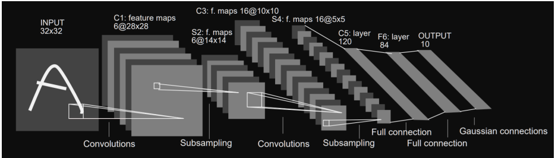

# LeNet-5

*Last update: 2024.11.29*

## Get started
These tutorials courses are done using Python notebooks.

### Install prerequesities

```
python3 -m venv .venv

# Activate the environment
# Linux/MacOs
source .venv/bin/activate

# Windows
.\.venv\Scripts\activate

# Install the dependencies
pip install -r requirements.txt
```

### Leave the environment after usage
```
deactivate
```

## **TP : Implémentation d'un CNN - LeNet-5 sur GPU**

### **Objectifs & Méthodes de travail:**

Les objectif de ces 4 séances de TP de HSP sont :
- Apprendre à utiliser CUDA,
- Etudier la complexité de vos algorithmes et l'accélération obtenue sur GPU par rapport à une éxécution sur CPU,
- Observer les limites de l'utilisation d'un GPU,
- Implémenter "from scratch" un CNN : juste la partie inférence et non l'entrainement,
- Exporter des données depuis un notebook python et les réimporter dans un projet cuda,
- Faire un suivi de votre projet et du versionning à l'outil git

### **Implémentation d'un CNN** 
L'objectif à terme de ces 4 séances est d'implémenter l'inférence dun CNN très claissque : LeNet-5 proposé par Yann LeCun et al. en 1998 pour la reconnaissance de chiffres manuscrits.

La lecture de cet article vous apportera les informations nécessaires pour comprendre ce réseau de neurone.



**Layer 3 Attention**: Contraitement à ce qui est décrit dans l'article, la 3eme couche du CNN prendra en compte tous les features pour chaque sortie.

## **Partie 1 -** Prise en main de CUDA: Multiplication de matrices

**Multiplication de matrices**

**Paramètres:**
- n : nombre de lignes de la matrice,
- p : nombre de colonnes de la matrice si n différent de p,
- M : pointeur de la matrice

**Allocation de mémoire** <br>
L'allocation de la mémoire (malloc) se fera dans votre fonction principale main.

**Création d'une matrice sur CPU** <br>
Cette fonction initialise une matrice de taille n x p Initialisez les valeurs de la matrice de façon aléatoire entre -1 et 1.

```
void MatrixInit(float *M, int n, int p)
```

**Résultat:**:<br>
Execute 
`./matrix`
```
-0.46 -0.61 0.67 
-0.17 -0.96 -0.69 
0.38 0.61 -0.35
```


**Affichage d'une matrice sur CPU**<br>
Cette fonction affiche une matrice de taille n x p.

```
void MatrixPrint(float *M, int n, int p)
```

**Résultat:**: 
Execute 
`./matrix-print`
```
-0.20 0.83 0.16 0.98 -0.02 
0.68 -0.20 0.45 0.77 -0.09 
0.75 -0.13 0.37 0.22 -0.24
```

**Addition de deux matrices sur CPU** <br>
Cette fonction additionne deux matrices M1 et M2 de même taille n x p.
```
void MatrixAdd(float *M1, float *M2, float *Mout, int n, int p)
```

**Résultat:**<br>
Execute 
`./matrix-add`
```
Matrice M1 :
-0.54 0.39 -0.73 -0.78 
-0.09 -0.42 -0.84 0.70 
0.70 -0.04 -0.18 -0.80 

Matrice M2 :
-0.54 0.39 -0.73 -0.78 
-0.09 -0.42 -0.84 0.70 
0.70 -0.04 -0.18 -0.80 

M1 + M2:
-1.08 0.77 -1.47 -1.56 
-0.18 -0.84 -1.69 1.40 
1.41 -0.08 -0.37 -1.61
```

**Addition de deux matrices sur GPU** <br>
Cette fonction additionne deux matrices M1 et M2 de même taille n x p Vous pouvez considérer les
dimensions des matrices comme les paramètres gridDim et blockDim : les lignes correspondent aux blocks,
les colonnes correspondent aux threads.
```
__global__ void cudaMatrixAdd(float *M1, float *M2, float *Mout, int n, int p)
```

**Multiplication de deux matrices NxN sur CPU** <br>
Cette fonction multiplie 2 matrices M1 et M2 de taillle n x n.
```
void MatrixMult(float *M1, float *M2, float *Mout, int n)
```

